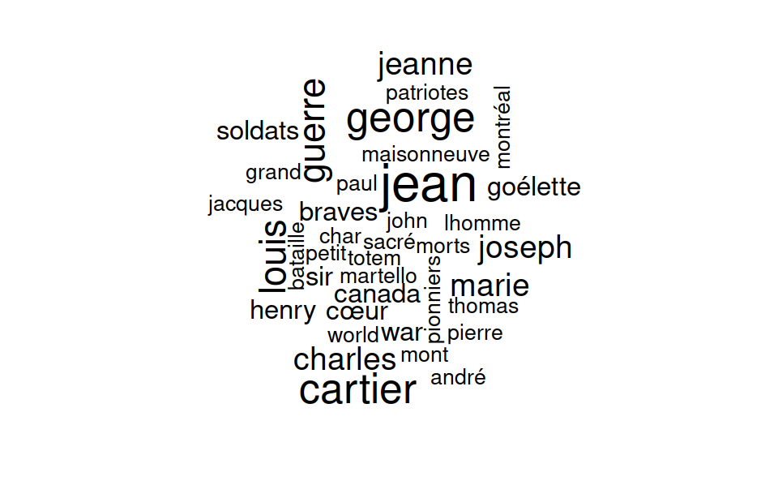

<!--  -->


Petit projet  vite-fait bien-fait qui utilise les données de openstreetmaps pour cartographier les monuments, mémoriaux et autres "artwork" de la province de Québec.  Ensuite, je regarde quels sont les top 10 mots les plus courants parce que c'est possible.
```{r setup, include =F, echo =F}
#
# TODO : valider ceci : Chunk options must be written in one line; no line breaks are allowed inside chunk options;
# https://yihui.name/knitr/options/
knitr::opts_chunk$set(echo = FALSE, 
                      collapse = FALSE,
                      warning = FALSE,
                      error = FALSE,
                      message = FALSE,
                      fig.align= "center",
                      fig.width = 10,
                      highlight = TRUE,
                      cache = FALSE,
                      cache.lazy = FALSE
) # fixes long vecto rnot supported quand on cache des gros éléments https://stackoverflow.com/questions/39417003/long-vectors-not-supported-yet-error-in-rmd-but-not-in-r-script
```

```{r}
suppressMessages(
  suppressWarnings({
    library(tidyverse)
    library(osmdata)
    library(sf)
     library(mapview)
    library(tokenizers)
    library(tidytext)
    library(lsa) #  stopwords in French and english
    data("stopwords_fr")
    data("stopwords_en")
  })
)

get_sf_from_osmdata <- function(x){
  x_unique <- x %>% osmdata::unique_osmdata()
  dplyr::bind_rows(x_unique[stringr::str_detect(names(x_unique), "osm_")]) 
}

```

```{r}
bb <- getbb("Quebec, Canada", format_out = "sf_polygon") 
bb <-  bb[1,] # garder le polygone de la province de québec
```


```{r, echo = FALSE}


# x <- bb %>% opq() %>%
#   add_osm_feature(key= "memorial"
#   )%>%
#   osmdata_sf()
# 
# y <-  bb %>% opq() %>%
#   add_osm_feature(key= "monument"
#   )%>%
#   osmdata_sf()
# 
# statue <-  bb %>% opq() %>%
#   add_osm_feature(key= "statue"
#   )%>%
#   osmdata_sf()
# 
# 
# historic <-  bb %>% opq() %>%
#   add_osm_feature(key= "historic"
#   )%>%
#   osmdata_sf()
# 
# 
# tourism <-  bb %>% opq() %>%
#   add_osm_feature(key= "tourism"
#   )%>%
#   osmdata_sf()
# 


#historic$osm_points %>% filter(!is.na(name))  %>% st_drop_geometry() %>%  count(historic) %>% arrange(desc(n))
#         historic  n
# 1       memorial 25
# 2       monument 18
# 3          ruins  4
# 4    battlefield  2
# 5      city_gate  2
# 6            yes  2
# 7           <NA>  2
# 8       building  1
# 9         castle  1
# 10 wayside_cross  1

#tourism$osm_points %>% filter(!is.na(name))  %>% st_drop_geometry() %>%  count(tourism) %>% arrange(desc(n))
#         tourism  n
# 1         hotel 52
# 2    attraction 31
# 3   guest_house 22
# 4       artwork 19
# 5         motel 16
# 6     viewpoint 16
# 7        museum 14
# 8       gallery  9
# 9   information  9
# 10          inn  3
# 11    apartment  2
# 12       chalet  2
# 13       hostel  2
# 14          yes  2
# 15     aquarium  1
# 16    camp_site  1
# 17 caravan_site  1
# 18  picnic_site  1
# 19          spa  1
# 20   theme_park  1

```

```{r}

if(FALSE){
historic_memorial <-  bb %>% opq() %>%
  add_osm_feature(key= "historic", value = "memorial")%>%
  osmdata_sf() %>% 
  get_sf_from_osmdata()  %>%
  filter(!is.na(name))


historic_monument <-  bb %>% opq() %>%
  add_osm_feature(key= "historic", value = "monument")%>%
  osmdata_sf() %>% 
  get_sf_from_osmdata() %>%
  filter(!is.na(name))

tourism_artwork <- bb %>% opq(timeout = 120) %>%
  add_osm_feature(key= "tourism", value = "artwork")%>%
  osmdata_sf() %>% 
  get_sf_from_osmdata() %>%
  filter(!is.na(name))

write_rds(historic_memorial, "historic_memorial.rds")
write_rds(historic_monument, "historic_monument.rds")
write_rds(tourism_artwork, "tourism_artwork.rds")
} else {
  historic_memorial <- read_rds("historic_memorial.rds")
  historic_monument <- read_rds("historic_monument.rds")
  tourism_artwork <- read_rds ("tourism_artwork.rds")
}
z1 <- historic_memorial[st_within(historic_memorial, bb, sparse = FALSE),]
z2 <- historic_monument[st_within(historic_monument, bb, sparse = FALSE),]
z3 <- tourism_artwork[st_within(tourism_artwork, bb,  sparse = FALSE),]

all_three <- bind_rows(z1 %>% mutate(type = "historic memorial"), 
                       z2 %>% mutate(type = "historic monument"),
                       z3 %>% mutate(type = "tourism artwork")
                       )

all_three %>% select(name, type,  artwork_type) %>%# filter(str_detect(toupper(name),paste0(toupper(top10), collapse = "|"))) %>%
  mapview(zcol = "type",map.types = c( "CartoDB.DarkMatter"))
```


quels sont les mots les plus utilisés dans les titres?  
```{r}
mots <- all_three %>% st_drop_geometry() %>% select(name) %>%  unnest_tokens(., word, name) 

# enlever les stop words français et anglais 
test <- mots %>%
  anti_join(tibble(word = stopwords_fr)) %>%
  anti_join(tibble(word = stopwords_en))


# anything else I should remove?   
test %>% count(word) %>% arrange(desc(n))

all_drop <- tibble(word = c("monument", "murale", "statue", "the", "historique", "site", "croix", "maison", "mémorial", "and", "buste", "cenotaph", "hommage", "place", "saint", "cénotaphe","jardin", "lieu","national", "patrimonial", "sculpture","st", "tour", "fontaine", "mémoire", "memorial", "plaque", "pont", "village", "ans","art", "arts", "arbres" ))

test2 <- test %>% anti_join(all_drop)
top10 <- test2 %>% count(word) %>% arrange(desc(n))  %>% head(10) 
test2$word %>% wordcloud::wordcloud()

```