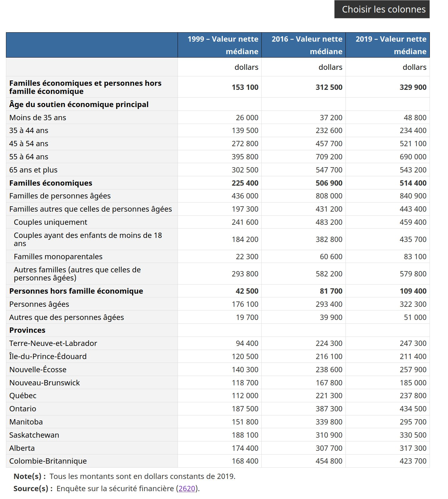
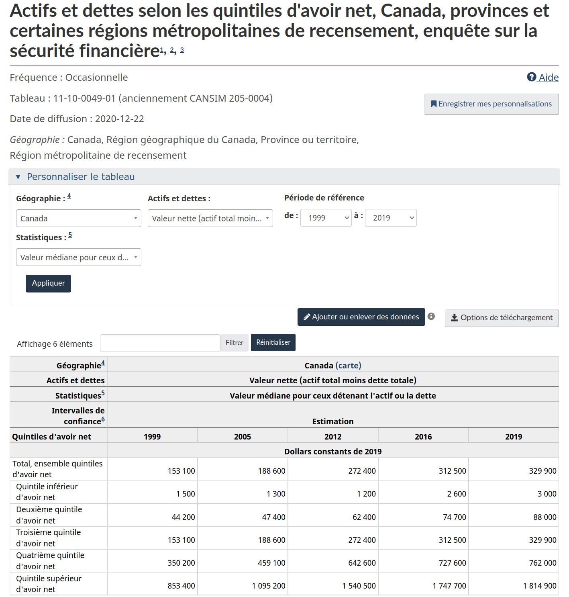
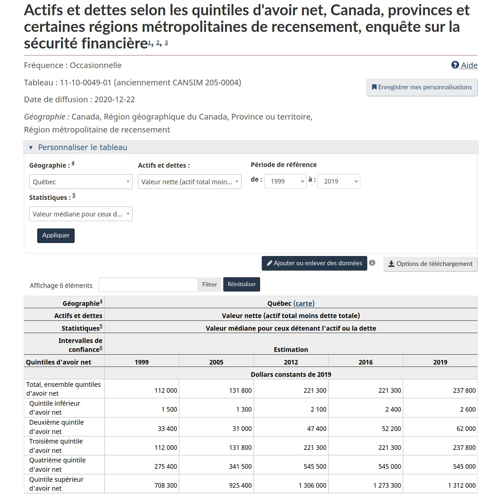

```{r setup, include=FALSE}
knitr::opts_chunk$set(
  echo = FALSE,
  message = FALSE,
  warning = FALSE,
  #dpi = 150,
  #fig.width = 5,
  #fig.height = 5,
  cache = FALSE # cache= TRUE leads to Error: path for html_dependency not found: error
)
library(matrixStats) # pour weightedMedian https://stackoverflow.com/questions/2748725/is-there-a-weighted-median-function
library(dplyr)
library(sf)
library(readr)
library(tidyr)
library(janitor)
library(readr)
library(stringr)
library(ggplot2)
library(ggspatial)# for annotation_map_tile
library(ggtext) # for element markdown
library(hrbrthemes)
library(tidygeocoder)
library(patchwork)
library(gt)
library(wesanderson)

ggplot2::theme_set(theme_minimal()) # this ggplot2 theme uses roboto condensed font, which works well with the font used for the whole document.
#options(ggplot2.discrete.fill  = function() scale_fill_viridis_d() )
options(ggplot2.discrete.fill  = function() scale_fill_manual(values = wes_palette(4, name = "Darjeeling1", type = "discrete")))
options(ggplot2.continuous  = function() scale_fill_manual(values = wes_palette(8, name = "Darjeeling1", type = "continuous")))

#options(ggplot2.continuous.fill  = function() scale_fill_viridis_c())
options(ggplot2.discrete.colour = function() scale_color_viridis_d())
options(ggplot2.continuous.colour = function() scale_color_viridis_c())
options(scipen=999)


```

Ils l'ont encore fait.  Québec Solidaire a identifié le bon problème (bravo)et proposé une solution étrange.

```{r}

blogdown::shortcode('tweet', '1567150861448511488')
```

```{r}
blogdown::shortcode('tweet', '1567150862723588097')
```

Gabriel Nadeau-Dubois dit que quelqu'un dans le top 5% est un ultra-riche.  C'est drôle, avant on était  "We are the 99%", maintenant il vise "We are the 95%".

Si vous avez un million de dollar à 65 ans (et pas de maison), vous avez assez d'argent pour dépenser environ 50 000$ par année jusqu'à votre mort.
Ce n'est certainement pas ça être un ultra-riche.

Mais surtout, j'ai la facheuse impression que quelqu'un qui a 1 million à 65 ans n'est pas le top 5%, mais plutôt quel part autour du 25-30% et qu'on se retrouverait ainsi à taxer le quart des nouveaux retraités.  

Est-ce qu'on est rendu à dire "We are the 75%" ?  

C'est bien beau "eat the rich", mais ça commence à faire beaucoup de riches à manger...

On creuse!  

# Les données  

La meilleure source de données au Canada pour la valeur nettes de gens, c'est l'enquête sur la sécurité financières des ménages de statistique canada.  Déjà, le plus gros problème c'est qu'elle vise le ménage, plutôt que l'individu.  L'information qu'elle va nous donner va donc être la valeur nette des ménages.   

Le premier tableau à voir est donc le Tableau 1 dans le Quotidien du 22 décembre 2020. 

https://www150.statcan.gc.ca/n1/daily-quotidien/201222/dq201222b-fra.htm



La richesse médiane des ménages au Canada était de 329 900$ en 2019.
Chez les Québécois , elle était de seulement 237 800$.


Quand on regarde par âge, on se rend compte que plus on est vieux, plus on a accumulé d'avoirs en prévision de la retraite.  Ainsi, la médiane des 55-64 ans était de 690 000$

```{r}
age_canada <- tribble(~gr_age, ~percentile,  ~avoir_net,  ~class,
        "34-moins", "50", 48800, "canada",
        "35-44", "50", 234400,  "canada",
        "45-54", "50", 521100,  "canada",
        "55-64", "50", 690000,  "canada",
        "65-plus", "50", 543200,  "canada",)
#age_canada
```
```{r}
age_canada %>%
  ggplot(aes(x=gr_age, y = avoir_net)) +
  geom_col()+ 
  labs(
    title = "Avoir net médian selon l'âge pour les unités familiales canadiennes en 2019"
    )
```


Le problème, c'est qu'on veut connaître le 95e percentile, chez les Québécois, pour les 55-64 ans et que le tableau ne permet de ventiler que par une variable à la fois (âge, ou province) en plus de n'avoir que la médiane.


Il existe un autre tableau qui permet d'avoir plus de détails, le tableau [11-10-0049-01](https://www150.statcan.gc.ca/t1/tbl1/fr/tv.action?pid=1110004901&pickMembers%5B0%5D=1.1&pickMembers%5B1%5D=2.27&pickMembers%5B2%5D=4.5&cubeTimeFrame.startYear=1999&cubeTimeFrame.endYear=2019&referencePeriods=19990101%2C20190101).



On y voir encore que la richesse médiane est de 329 900$ au Canada.  
Ce qui est intéressant, c'est qu'on apprend la valeur médiane dans chaque quintile d'avoir net.
Ainsi, la médiane du quintile inférieur d'avoir net ( 3000$), correspond au percentile à mi-chemin entre 0 et 20, donc le 10e percentile.  

Le tableau ne permet donc de savoir que les  avoirs nets des 10e 30e, 50e, 70e et 90e percentiles:

```{r}

percentiles_canada <- tribble(~percentile, ~avoir_net, ~class,
        "10", 3000, "canada",
        "30", 88000, "canada",
        "50", 329900, "canada",
        "70", 762000, "canada",
        "90", 1814900, "canada")
percentiles_canada
```

très cool, on avance!

En plus, on peut choisir la géographie de notre choix, soit le Québec.



Ça concorde, la médiane du Québecv est de 237 800, soit ce qu'on avait déjà vu dans le quotidien.  Voici les autres chiffres qu'on apprend pour le Québec:

```{r}
percentiles_quebec <- tribble(~percentile, ~avoir_net, ~class,
        "10", 2600, "quebec",
        "30", 62000, "quebec",
        "50", 237800, "quebec",
        "70", 545000, "quebec",
        "90", 1312000 ,"quebec") 
percentiles_quebec
```


```{r}
percentiles_quebec %>%  bind_rows(percentiles_canada) %>%
  ggplot(aes(x=percentile, y = avoir_net, fill = class ))+
  geom_col(position = "dodge")+ 
  labs(
    title = "Avoir net médian selon le percentile pour les unités familiales canadiennes et québécoises en 2019"
    )
  
```


On a progressé pas mal!  On a la richesse du ménage au 90e percentile au Québec.  
C'est pas encore ça qu'on veut!  
On veut la richesse de l'individu au 95e percentile des 55-64 ans au Québec.
On va devoir continuer à travailler.

Pour ce faire, on va télécharger les [donnes du PUMF de l'Enquête sur la Sécurité Financière](https://www150.statcan.gc.ca/n1/pub/13m0006x/13m0006x2021001-fra.htm) (prononcé poumf, pour public use microdata file) et on va faire notre tableau nous même!

J'ai donc suivi le lien et cliqué "Télécharger période de référence 2019" pour avoir un fichier zip

Le fichier zip contient les fichiers suivants qui sont intéressants:
`SFS2019_EFAM_PUMF.txt` est un fichier texte de type "fixed width". Ça va être chiant à importer
`SAS/SFS2019_EFAM_PUMF_i.SAS` explique les caractéristique du fichier à importer (largeur et type des colonnes dans le fichier texte)
`SFS2019_PUMF_F.pdf` contient le dictionnaire des données (c'est quoi la colonne province? c'est PPVRES.  C'est quoi le code de la province de Québec? c'est 24.)

Ok, let's go, j'importe ça dans R.


```{r}
pumf <- read_fwf(here::here("content/post/2022-09-06-taxer-les-ultras-riches-ou-taxer-les-retrait-s/data/SFS2019_PUMF_F/SFS2019_EFAM_PUMF.txt"),
                 col_types = list(
                   PEFAMID  = col_character(),
                   PAGEMIEG   = col_character(),
                   PASRINTG   = col_character(),
                   PDWTYP     = col_character(),
                   PEDUCMIE   = col_character(),
                   PEFMJSIF   = col_character(),
                   PFCRN      = col_character(),
                   PFMTYPG    = col_character(),
                   PFRSPST    = col_character(),
                   PFSZ0017   = col_character(),
                   PFSZ1824   = col_character(),
                   PFSZ2544   = col_character(),
                   PFSZ4564   = col_character(),
                   PFSZ65UP   = col_character(),
                   PLFCHRME   = col_character(),
                   PLFFPTME   = col_character(),
                   PLFPDMEG   = col_character(),
                   PPVRES     = col_character(),
                   PREGION    = col_character(),
                   PRETIRME   = col_character(),
                   VERDATE    = col_character(),
                   .default = col_double()
                 ),
                 fwf_positions(
                   c(
                     1,
                     6,
                     18,
                     20,
                     21,
                     22,
                     23,
                     31,
                     32,
                     34,
                     35,
                     36,
                     44,
                     46,
                     47,
                     48,
                     49,
                     50,
                     51,
                     53,
                     54,
                     55,
                     57,
                     58,
                     60,
                     64,
                     65,
                     66,
                     67,
                     73,
                     74,
                     75,
                     76,
                     77,
                     78,
                     79,
                     80,
                     81,
                     82,
                     83,
                     84,
                     85,
                     86,
                     94,
                     95,
                     96,
                     97,
                     105,
                     113,
                     115,
                     123,
                     128,
                     129,
                     130,
                     131,
                     132,
                     133,
                     134,
                     135,
                     136,
                     137,
                     138,
                     139,
                     148,
                     149,
                     150,
                     151,
                     152,
                     154,
                     155,
                     156,
                     157,
                     169,
                     181,
                     193,
                     205,
                     217,
                     229,
                     241,
                     253,
                     265,
                     277,
                     289,
                     301,
                     313,
                     325,
                     337,
                     349,
                     361,
                     373,
                     385,
                     397,
                     409,
                     421,
                     433,
                     445,
                     457,
                     469,
                     481,
                     493
                   ),
                   c(
                     5,
                     17,
                     19,
                     20,
                     21,
                     22,
                     30,
                     31,
                     33,
                     34,
                     35,
                     43,
                     45,
                     46,
                     47,
                     48,
                     49,
                     50,
                     52,
                     53,
                     54,
                     56,
                     57,
                     59,
                     63,
                     64,
                     65,
                     66,
                     72,
                     73,
                     74,
                     75,
                     76,
                     77,
                     78,
                     79,
                     80,
                     81,
                     82,
                     83,
                     84,
                     85,
                     93,
                     94,
                     95,
                     96,
                     104,
                     112,
                     114,
                     122,
                     127,
                     128,
                     129,
                     130,
                     131,
                     132,
                     133,
                     134,
                     135,
                     136,
                     137,
                     138,
                     147,
                     148,
                     149,
                     150,
                     151,
                     153,
                     154,
                     155,
                     156,
                     168,
                     180,
                     192,
                     204,
                     216,
                     228,
                     240,
                     252,
                     264,
                     276,
                     288,
                     300,
                     312,
                     324,
                     336,
                     348,
                     360,
                     372,
                     384,
                     396,
                     408,
                     420,
                     432,
                     444,
                     456,
                     468,
                     480,
                     492,
                     502
                   ),
                   c(
                     "PEFAMID",
                     "PWEIGHT",
                     "PAGEMIEG",
                     "PAS1MRAG",
                     "PAS1MRG1",
                     "PAS1MRG2",
                     "PASR1MFA",
                     "PASR1MR" ,
                     "PASRBUYG",
                     "PASRCNMG",
                     "PASRCON" ,
                     "PASRCST" ,
                     "PASRCURG",
                     "PASRDPO1",
                     "PASRDPO2",
                     "PASRDPO3",
                     "PASRDPO4",
                     "PASRDPO5",
                     "PASRDWNG",
                     "PASRFNMG",
                     "PASRINT" ,
                     "PASRINTG",
                     "PASRMOAG",
                     "PASRMPFG",
                     "PASRMRYG",
                     "PASRRNTG",
                     "PASRSKP" ,
                     "PATTCRC" ,
                     "PATTCRLM",
                     "PATTCRR" ,
                     "PATTCRU" ,
                     "PATTDIF" ,
                     "PATTLCP" ,
                     "PATTLCR" ,
                     "PATTPAYD",
                     "PATTRSA" ,
                     "PATTRSH" ,
                     "PATTRSL" ,
                     "PATTRSP" ,
                     "PATTRSR" ,
                     "PATTSTIN",
                     "PATTSKP" ,
                     "PATTLMLC",
                     "PBUSIND" ,
                     "PDWTYP"  ,
                     "PEDUCMIE",
                     "PEFATINC",
                     "PEFGTR"  ,
                     "PEFMJSIF",
                     "PEFMTINC",
                     "PEXMG1A" ,
                     "PEXMG1F" ,
                     "PFCRN"   ,
                     "PFMTYPG" ,
                     "PFRSPST" ,
                     "PFSZ"    ,
                     "PFSZ0017",
                     "PFSZ1824",
                     "PFSZ2544",
                     "PFSZ4564",
                     "PFSZ65UP",
                     "PFTENUR" ,
                     "PINHERT" ,
                     "PLFCHRME",
                     "PLFFPTME",
                     "PLFPDMEG",
                     "PNBEARG" ,
                     "PPVRES"  ,
                     "PREGION" ,
                     "PRETIRME",
                     "PGDRMIE" ,
                     "PWAOTPEN",
                     "PWAPRVAL",
                     "PWARPPG" ,
                     "PWARPPT" ,
                     "PWARRIF" ,
                     "PWARRSPL",
                     "PWASTBND",
                     "PWASTDEP",
                     "PWASTMUI",
                     "PWASTOIN",
                     "PWASTONF",
                     "PWASTRST",
                     "PWASTSTK",
                     "PWASTVHE",
                     "PWATFS"  ,
                     "PWATOTPG",
                     "PWATOTPT",
                     "PWBUSEQ" ,
                     "PWDPRMOR",
                     "PWDSLOAN",
                     "PWDSTCRD",
                     "PWDSTLOC",
                     "PWDSTODB",
                     "PWDSTOMR",
                     "PWDSTVHN",
                     "PWDTOTAL",
                     "PWNETWPG",
                     "PWNETWPT",
                     "VERDATE"
                   )
                 )

)
```


Ça ressemble à ça une fois importé.  On a 10 442 lignes et une centaine de colonnes.
Les variables d'intérêt sont:
PWEIGHT , le poids de l'observation.
PWNETWPG, la valeur nette de l'unité familiale selon la base de long terme.  
PWNETWPT, la valeur nette de l'unité familiale selon la base de la terminaison  (je ne sais pas quelle est la bonne base à utiliser, mais les chiffres se ressemblent)
PAGEMIEG, la catégorie d'âge 
PPVRES, la province de résidence  

```{r}
pumf %>% print(n=10)
```

C'est quoi la valeur médiane de la valeur nette au Canada.
On va utiliser la fonctioin Hmisc::wtd.quantile(),  car on doit utiliser les poids d'échantillonnage.

```{r}
Hmisc::wtd.quantile(pumf$PWNETWPT, pumf$PWEIGHT, probs = 0.50)
```

338 450!!  C'est proche  du chiffre officiel de 329 900$ qu'on avait dans les tableaux.  Ça ne semble pas trop brisé.   Qu'en est-il des autres percentiles qu'on connait (10, 30, 50, 70, 90) ?


```{r}

my_percentiles <- c(0.10, 0.30, 0.5, 0.7, 0.9)
percentiles_canada_pumf <- tibble(percentile  = as.character(100 * my_percentiles),
      avoir_net =  Hmisc::wtd.quantile(pumf$PWNETWPT, pumf$PWEIGHT, probs = my_percentiles),
      class = "canada_pumf"
)
percentiles_canada_pumf %>% bind_rows(percentiles_canada) %>% 
  ggplot(aes(x=percentile, y = avoir_net, fill = class ))+
  geom_col(position = "dodge")+ 
  labs(
    title = "Avoir net médian selon le percentile pour les unités familiales canadiennes\n selon tableaux canada et selon nos calculs dans pumf",
    subtitle = "YES! on peut reproduire les chiffres canadiens avec notre échantillon!"
    )
```
ok , on est vraiment proches!!  


Juste pour être sûrs, est-ce qu'on est capable de reproduire les chiffres par groupe d'âge aussi?

```{r}
my_pumf <- pumf  %>%
  mutate(gr_age =
           case_when
         ( PAGEMIEG %in% c("01","02","03","04") ~ "34-moins",
           PAGEMIEG %in% c("05","06") ~ "35-44",
           PAGEMIEG %in% c("07","08") ~ "45-54",
           PAGEMIEG %in% c("09","10") ~ "55-64",
           PAGEMIEG %in% c("11","12","13","14") ~ "65-plus",

         )
  ) %>%
  ungroup()


age_canada_pumf <- my_pumf %>% group_by(gr_age) %>%
  summarise(avoir_net = Hmisc::wtd.quantile(PWNETWPT, PWEIGHT, probs = 0.50), .groups = "drop") %>%
  mutate(percentile = "50", class = "canada_pumf")


age_canada_pumf %>% bind_rows(age_canada) %>% 
  ggplot(aes(x=gr_age, y = avoir_net, fill = class ))+
  geom_col(position = "dodge")+ 
  labs(
    title = "Avoir net médian selon l'âge pour les unités familiales canadiennes\n selon tableaux canada et selon nos calculs dans pumf",
    subtitle = "YES! on peut reproduire les chiffres canadiens avec notre échantillon!"
    )

```

What about les percentiles du Québec?


```{r}
my_percentiles <- c(0.10, 0.30, 0.5, 0.7, 0.9)
pumf_qc <- pumf %>% filter(PPVRES == "24")

percentiles_quebec_pumf <- tibble(percentile  = as.character(100 * my_percentiles),
      avoir_net =  Hmisc::wtd.quantile(pumf_qc$PWNETWPT, pumf_qc$PWEIGHT, probs = my_percentiles),
      class = "quebec_pumf"
)
percentiles_quebec_pumf %>% bind_rows(percentiles_quebec) %>% 
  ggplot(aes(x=percentile, y = avoir_net, fill = class ))+
  geom_col(position = "dodge")+ 
  labs(
    title = "Avoir net médian selon le percentile pour les unités familiales québécoises\n selon tableaux quebec et selon nos calculs dans pumf",
    subtitle = "YES! on peut reproduire les chiffres officiels québécois avec notre échantillon!"
    )
  
```


Ok, ça veut dire qu'on est vraiment capables de reproduire les chiffres officiels à peu de chose près.  On n'aurait pas pu espérer mieux sachant qu'on travaille avec un échantillon de ce qui est utilisé pour les chiffres officiels.

Maintenant qu'on a confirmé que l'on sait comment travailler avec le PUMF, nous allons enfin pouvoir créer des données "originales" 


here we gooooooooooooo
commençons par calculer plus de percntiles au Québec.


```{r}
my_many_percentiles <- c(0.01, 0.05, 0.10, 0.30, 0.5, 0.7, 0.8, 0.9, 0.95, 0.99)
pumf_qc <- pumf %>% filter(PPVRES == "24")

percentiles_quebec_pumf <- tibble(percentile  = stringr::str_pad(as.character(100 * my_many_percentiles), side = "left", width = 2, pad ="0" ),
      avoir_net =  Hmisc::wtd.quantile(pumf_qc$PWNETWPT, pumf_qc$PWEIGHT, probs = my_many_percentiles),
      class = "quebec_pumf"
)
percentiles_quebec_pumf %>% 
  ggplot(aes(x=percentile, y = avoir_net, fill = class ))+
  geom_col(position = "dodge")+ 
  labs(
    title = "Le 95e percentile de Québécois avait un avoir net de 1 941 500$.",
    subtitle = "Est-ce que QS a juste pris le chiffre de 2 millions par ménage puis l'a divisé par 2 pour avoir un montant par individu ?",
    caption = "PUMF et calculs de @coulsim"
    )
  
```
Le 95e percentile de Québécois avait un avoir net de 1 941 500$.
Est-ce que QS a juste pris le chiffre de 2 millions puis l'a divisé par 2 pour avoir un montant par individu en supposant que tous les ménages étaient composés d'un couple?  
Je ne serais pas surpris.

Supposons qu'ils ont fait ça et que la cible du 95% est de 2 millions de dollar d'avoir net par ménage.
La question qui demeure est "à quel percentile correspond le nombre de 2 millions de dollar dans chaque groupe d'âge?


```{r}
my_pumf %>%
  filter(PPVRES == "24") %>%
  group_by(gr_age) %>%
  summarise(pct_over_2_million = sum((PWNETWPT > 2e6) * PWEIGHT) / sum(PWEIGHT)) %>%
  gt(rowname_col = "gr_age")  %>%
  tab_header(
    title = "Pourcentage des ménages québécois avec un avoir net de plus de 2 millions",
    subtitle = "data: PUMF ESF 2019, calculs @coulsim"
  ) %>% 
  fmt_percent(columns = starts_with("pct"), decimals = 1, sep_mark = " ")  %>%
   cols_label(
    pct_over_2_million = "Pourcentage"
  )
  
```


```{r}

my_many_percentiles <- c(0.01, 0.05, 0.10, 0.30, 0.5, 0.7, 0.9, 0.95,  0.99)
avoirs_nets_quebec_par_age_pumf <- my_pumf %>%
  filter(PPVRES == "24") %>%
  group_nest(gr_age)  %>%
  mutate(avoir_nets = purrr::map2(data, gr_age, ~
      #tibble(percentile  = stringr::str_pad(as.character(100 * my_many_percentiles), side="left", pad  = "0", width = 2),
        tibble(percentile  = as.character(100 * my_many_percentiles), 
      avoir_net =  Hmisc::wtd.quantile(.x$PWNETWPT, .x$PWEIGHT, probs = my_many_percentiles),
      gr_age = .y,
      class = "quebec_pumf"
)
    
   ) ) %>%
  pull(avoir_nets) %>% 
  bind_rows(.)

```

```{r}
avoirs_nets_quebec_par_age_pumf %>% 
  ggplot(aes(x=percentile, y = avoir_net ))+
  geom_col(position = "dodge")+ 
  facet_wrap(~gr_age) + 
  labs(
    title = "10% des ménages de 55-64 ans et plus ont un avoir net de 2 million et plus",
    subtitle = "C'est le cas d'environ 5% des 45-54 et des , 2% des 35-44 et moins d'un pourcent des moins de 34 ans.",
    caption = "data: PUMF ESF 2019, calculs @coulsim"
    )
```

# Conclusion

* On n'a pas réussi à trouver la source de données utilisée par Québec Solidaire.  En effet, l'Enquête sur la sécurité des ménages a comme unité de sondage le ménage plutôt que l'individu.  
* On a remarqué à l'aide du PUMF qu'environ 5% des ménages québécois ont un avoir net supérieur à 1 941 500$. 
* Comment est-ce que QS a fait pour obtenir le chiffre de 5% des individus ont un avoir net supérieur à 1 000 000$ ? usqu'à ce que QS confirme leur source de données, je vais devoir faire supposer qu'ils ont fait l'hypothèse qu'un ménage comporte toujours 2 personnes (c'est faux) et qu'ils ont divisé ce nombre par deux pour arriver approximativement au 1 million par personne annoncé dans leur annonce.
* Le pourcentage de ménages ayant un avoir net supérieur à 2 millions varie évidemment avec l'âge. Ainsi, ce sont 10% des personnes qui atteignent l'âge de la retraite qui seraient considérées comme ultra-riches par QS.   


